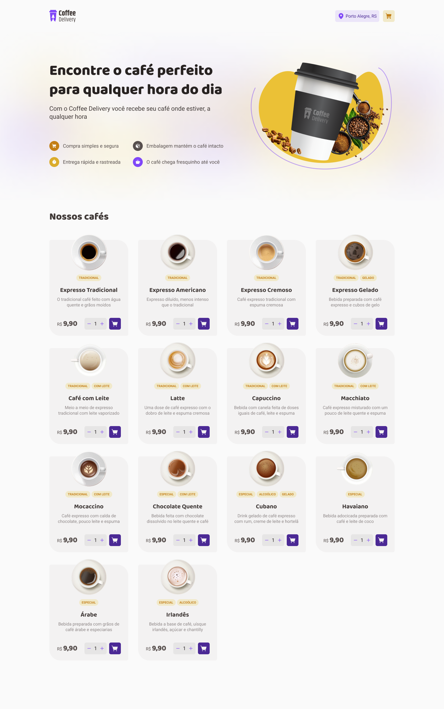

<h1 align="center">Boas-vindas ao projeto Coffee Delivery</h1>

Coffee Delivery é uma página web de catálogo e compra de cafés.
Esse projeto é um desafio da trilha de React do Ignite, nosso curso completo de especialização em React, React Native e Node.js.

  <a href="#-tecnologias">Tecnologias</a>&nbsp;&nbsp;&nbsp;|&nbsp;&nbsp;&nbsp;
  <a href="#-projeto">Projeto</a>&nbsp;&nbsp;&nbsp;|&nbsp;&nbsp;&nbsp;
  <a href="#memo-licença">Licença</a>

  

 

  

## 🚀 Tecnologias

Esse projeto foi desenvolvido com as seguintes tecnologias:

- React

## Projeto

Esse projeto foi desenvolvido a fim de criar páginas responsivas com React.